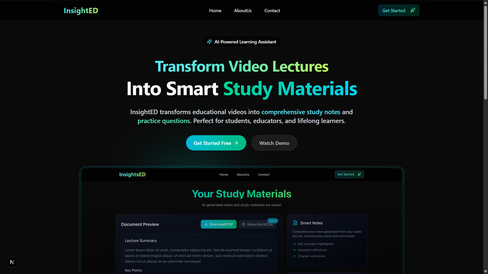
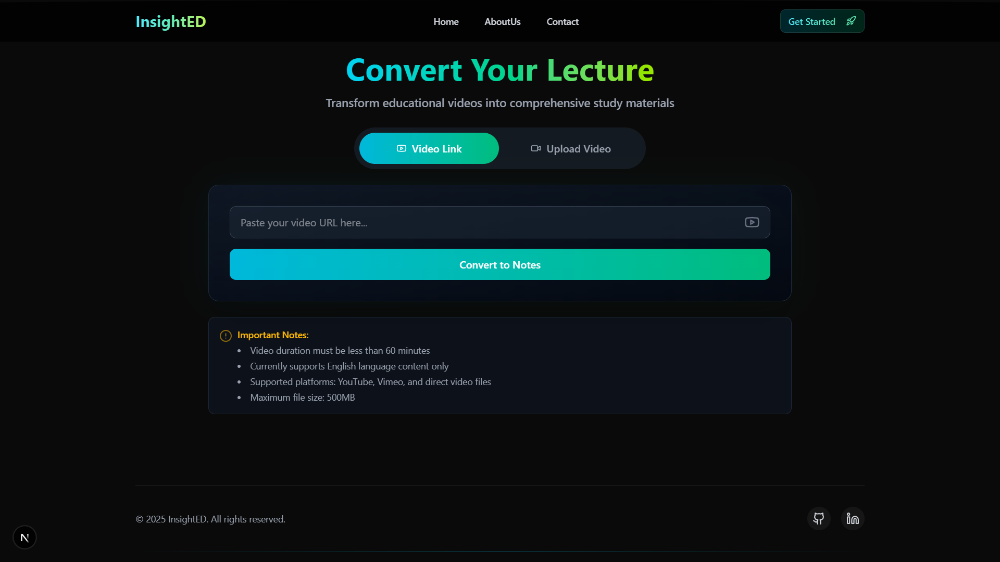
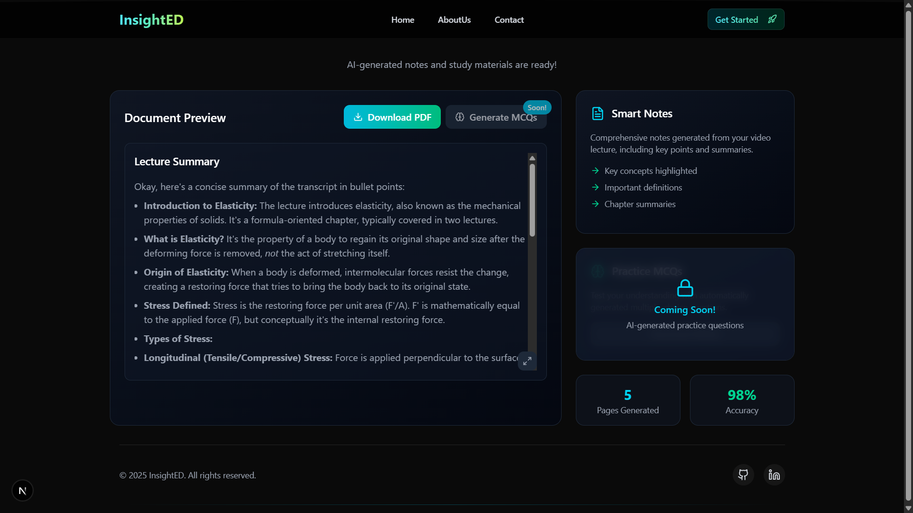
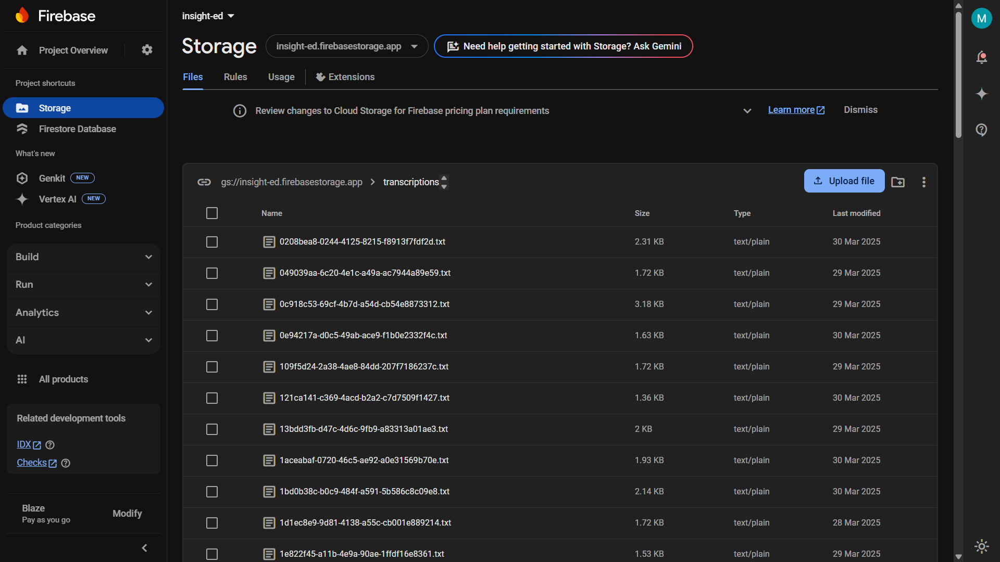

# 📌 InsightEd - AI-Powered YouTube Video Summarizer

🚀 **InsightEd** is a powerful AI-driven tool that extracts key insights from YouTube videos or uploaded videos by generating **summaries** and **MCQ test series** for instant evaluation. Built as a great help for **students**, it ensures speed, scalability, and real-time updates using **WebSockets**.

## 🔥 Features

- 🎯 **Summarizes YouTube Videos** - Get concise and insightful summaries.
- 🤖 **AI-Powered MCQs** - Generate quiz questions for learning reinforcement.
- 📡 **Real-time Updates** - Stay informed with WebSocket notifications.
- ☁️ **Cloud Storage** - Summaries are stored securely on Firebase.
- 💡 **Scalable & Fast** - Optimized with microservices and async processing.

---

## 🛠️ Tech Stack

- **Frontend**: Next.js
- **Backend**: Node.js, Express.js
- **AI Processing**: Google Gemini API, OpenAI API
- **Storage**: Firebase Cloud Storage
- **WebSockets**: Socket.io
- **Microservices**: Docker

---

## 🎬 How It Works

1️⃣ **User Inputs YouTube Link / Uploads Video**  
2️⃣ **Backend Downloads & Extracts Audio**  
3️⃣ **Transcription & AI Summarization**  
4️⃣ **MCQ Quiz Generation Using AI**  
5️⃣ **Data is Stored on Firebase**  
6️⃣ **User Receives Summary & MCQs**  
7️⃣ **Downloadable Summary in PDF Format**  

---
## 🚀 Getting Started With Frontend

### 1️⃣ Clone the Repository

```sh
git clone https://github.com/msxcodes/insightED.git
cd insightED
cd insightEd-frontend
```

### 2️⃣ Install Dependencies

```sh
npm install
```
### 4️⃣ Configure Environment Variables

Create a `.env` file in the root directory and add:

```ini
NEXT_PUBLIC_API_URL=http://localhost:5000
```

### 3️⃣ Start the Server

```sh
npm run dev
```
---

## 🚀 Getting Started With Backend

### 1️⃣ Clone the Repository

```sh
git clone https://github.com/msxcodes/insightED.git
cd insightED
cd insightEd-backend
```

### 2️⃣ Install Dependencies

```sh
npm install
```

### 3️⃣ Install Python Dependency

```sh
pip install yt-dlp
```

### 4️⃣ Configure Environment Variables

Create a `.env` file in the root directory and add:

```ini
PORT=5000

# OpenAI API
OPENAI_API_KEY=your_openai_api_key

# Google Gemini API
GEMINI_API_KEY=your_gemini_api_key

# Firebase
FIREBASE_BUCKET=your-project-id.appspot.com
FIREBASE_SERVICE_ACCOUNT={"type":"service_account","project_id":"your_project_id",...}
```

### 4️⃣ Start the Server

```sh
npm run dev
```

---

## 🖼️ Screenshots 

1️⃣ **Landing Page Overview**  


2️⃣ **User Inputs YouTube Link**  


3️⃣ **Summary Generated**  


4️⃣ **Firebase Storage View**  


---

## 🏗️ Deployment

### Setup DockerFile

```ini
FROM node:18-alpine AS builder

WORKDIR /app
COPY package*.json ./
RUN npm install --include=dev --legacy-peer-deps
COPY . .

FROM node:18-alpine
WORKDIR /app
RUN apk add --no-cache \
    python3 \
    py3-pip \
    ffmpeg \
    build-base \
    libc6-compat \
    libffi-dev \
    openssl-dev \
    && python3 -m venv /venv \
    && . /venv/bin/activate \
    && pip install --no-cache-dir --upgrade pip \
    && pip install --no-cache-dir yt-dlp brotli cryptography

COPY --from=builder /app/node_modules ./node_modules
COPY --from=builder /app ./

ENV NODE_ENV=production
ENV PATH="/app/node_modules/.bin:${PATH}"

EXPOSE 5000
CMD ["node", "src/server.js"]
```

### Deploy on **Vercel / Railway / Render**

1️⃣ Add environment variables in the hosting platform.

2️⃣ Deploy the frontend and backend.

3️⃣ Update the frontend to match the API URL.

---

## 🏆 Why InsightEd? (Problem Solving)

✅ **Perfect for Students & Educators** - Converts long videos into easy notes.  
✅ **Time-Saving** - Get summaries instantly.  
✅ **Hackathon-Ready** - Built for scalability and real-time use.  
✅ **Future-Ready** - Can integrate with LMS platforms.  

---

## 💡 Future Plans:

🔹 **Multi-Language Support**   
🔹 **Live Transcription & Summarization**   
🔹 **Freemium Model**   
🔹 **Affiliate & Partner Integrations**   
🔹**Mobile App**

## 📬 Team Info

👨‍💻 MegaMinds: [Mukul-Anand](https://github.com/anand-mukul), [Mohit-Singh](https://github.com/msxcodes), [Mrinal-Kumar](https://github.com/Darklord-41), [Shivangi-Kumari](https://github.com/Shivangi033)

🚀 **Let’s revolutionize learning together!**
